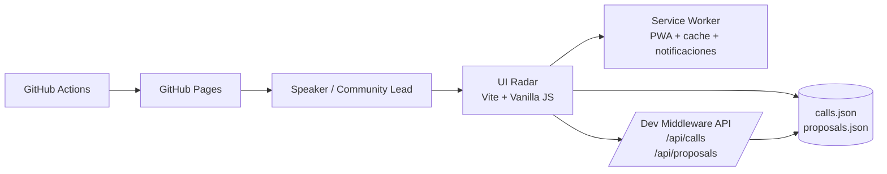
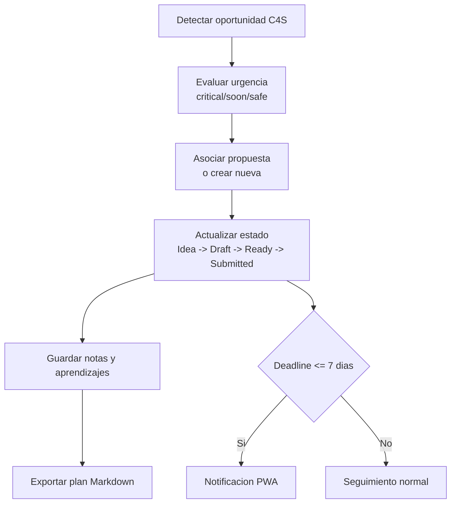
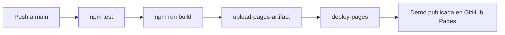

# Speaker C4S Radar

[](https://github.com/davidop/speaker-c4s-radar/actions/workflows/pages.yml)
[](LICENSE)
[](https://vitejs.dev)
[](https://github.com/features/copilot)

> Un radar visual para que speakers, MVPs y comunidades técnicas no pierdan oportunidades de Call for Speakers entre mensajes, posts y deadlines imposibles.

Repositorio de referencia para la sesión técnica **"Call for Speakers Z: entrena, aplica y conquista el escenario"** — 45 minutos de demo en vivo con GitHub Spark, GitHub Copilot y VS Code.

Este proyecto nace como una demo práctica para enseñar cómo GitHub Spark, GitHub Copilot y Visual Studio Code pueden ayudarnos a convertir una necesidad real de comunidad en una app útil, visual y fácil de adaptar.

---

## ¿Para qué sirve?

Los C4S aparecen y desaparecen. Este radar pasa de reaccionar tarde a operar con un sistema sencillo:

| Fase | Qué hace la app |
|---|---|
| 🔍 **Detectar** | Lista Call for Speakers activos con urgencia visual por deadline |
| ⏱️ **Priorizar** | Semáforo de riesgo: crítico / próximo / controlado |
| 📝 **Preparar** | Asocia propuestas de charla a cada oportunidad |
| 📬 **Seguir** | Pipeline kanban de candidaturas: Idea → Submitted → Accepted |

---

## Diagrama de arquitectura



## Flujo de trabajo del usuario



## Flujo de entrega CI/CD



---

## Demo en vivo


> Puedes ver la versión desplegada en GitHub Pages cuando esté activada desde Settings → Pages → GitHub Actions.

---

## Ejecutar en local

```bash
git clone https://github.com/davidop/speaker-c4s-radar.git
cd speaker-c4s-radar/demo
npm install
npm run dev
```

Abre la URL que muestre Vite (normalmente `http://localhost:5173`).

---

## Estructura del repositorio

```text
demo/                           App web (Vite + Vanilla JS)
  src/
    main.js                     Lógica principal de la app
    styles.css                  Estilos
    data/calls.json             Dataset de C4S de ejemplo
slides/                         Presentación de la sesión
session/                        Guion, agenda y runbook de demo
.github/
  workflows/pages.yml           CI/CD → GitHub Pages
  copilot-instructions.md       Contexto para GitHub Copilot
```

---

## Stack

| Herramienta | Rol en la sesión |
|---|---|
| **GitHub Spark** | Prototipar la app desde un prompt |
| **GitHub Copilot** | Evolucionar features en VS Code |
| **Vite** | Build y dev server del frontend |
| **GitHub Actions** | Despliegue automático a Pages |
| **Vanilla JS** | Sin frameworks: código legible en directo |

---

## Adapta este radar a tu stack

Puedes personalizar `demo/src/data/calls.json` con tus propias oportunidades y usar este repo como base de tu propio radar. Consulta [CONTRIBUTING.md](CONTRIBUTING.md) para saber cómo.

---

## Publicar tu fork en GitHub Pages

```bash
gh repo create speaker-c4s-radar --public --source=. --remote=origin --push
```

Activa **Pages** en `Settings → Pages → Source: GitHub Actions` y el workflow se encargará del resto.

---

## Automatizar búsqueda de C4S

Se ha añadido un workflow programado en [.github/workflows/c4s-discovery.yml](.github/workflows/c4s-discovery.yml) que:

1. Ejecuta discovery diario (cron) o manual.
2. Normaliza oportunidades al formato de [demo/src/data/calls.json](demo/src/data/calls.json).
3. Deduplica por `source` y por combinación `name + community`.
4. Filtra deadlines pasados.
5. Abre PR automático con resumen de resultados.

### Configuración rápida

1. Define fuentes activas en [demo/scripts/c4s-sources.json](demo/scripts/c4s-sources.json) o usa el secreto `C4S_EXTRA_SOURCES_JSON`.
2. Toma como plantilla [demo/scripts/c4s-sources.example.json](demo/scripts/c4s-sources.example.json).
3. Ejecuta localmente:

  npm run discover:c4s

4. El reporte queda en:
  - [demo/scripts/discovery-report.json](demo/scripts/discovery-report.json)
  - [demo/scripts/discovery-summary.md](demo/scripts/discovery-summary.md)

### Formato esperado de fuente

Cada fuente debe devolver una lista JSON. Campos aceptados por item:

- `name` o `title`
- `deadline` o `cfpDeadline` o `closesAt` o `date`
- `source` o `url`
- opcionales: `community`, `city`, `format`, `tags`, `audience`, `deadlineConfidence`, `status`

Si faltan campos opcionales, se aplican defaults desde la definición de fuente.

---

## Contribuir

¿Tienes una mejora, un bug o quieres añadir una oportunidad C4S al dataset de ejemplo?  
Lee [CONTRIBUTING.md](CONTRIBUTING.md) y abre un issue o un pull request.

### Flujo de comunidad

- Labels base versionados en [.github/labels.yml](.github/labels.yml).
- Backlog semilla para onboarding en [.github/ISSUES_PROPOSALS.md](.github/ISSUES_PROPOSALS.md).
- Plantillas de issue en [.github/ISSUE_TEMPLATE](.github/ISSUE_TEMPLATE).

---

## Licencia

[MIT](LICENSE) · Hecho con GitHub Copilot para la comunidad técnica hispana.
